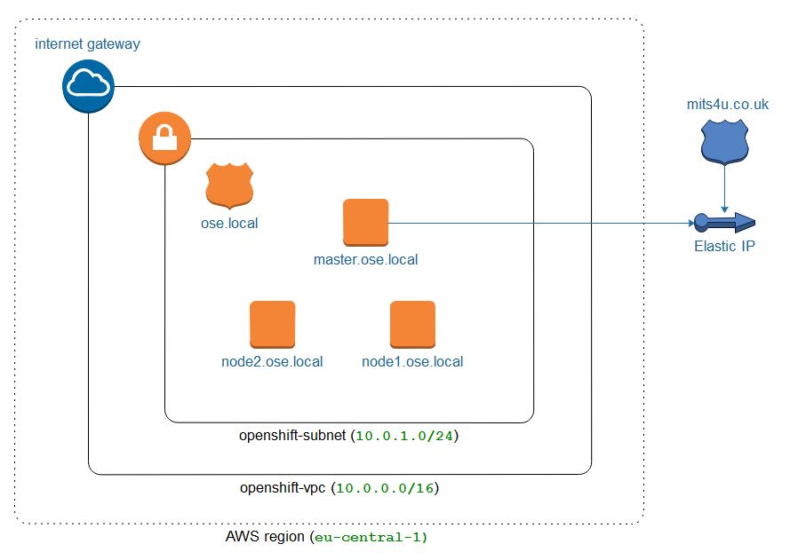

# openshift-aws-setup

## Overview

This repo is a set of Ansible automation scripts that:
 - provisions AWS infrastructure
 - deploys Openshift (Origin or Container Platform)

AWS related configuration can be customised by modifying ```vars/aws-config.yaml```. Note that the number of application nodes is configurable, the default is 3.

The OpenShift inventory can be customized by modifying ```roles/openshift-install/files/openshift_inventory.cfg```, note that epheremal metrics is enabled by default as well as the AWS cloud provider.

## Prerequisites

 - AWS credentials: access key & secret --> http://docs.aws.amazon.com/general/latest/gr/managing-aws-access-keys.html
 - Ansible installed --> http://docs.ansible.com/ansible/intro_installation.html

## Run

For OpenShift Origin, the command ```./openshift-playbook-run.sh <AWS_ACCESS_KEY_ID> <AWS_SECRET_ACCESS_KEY>``` will execute the Ansible playbook
with a set of roles which will provision AWS infrastructure and install Openshift on top of that.

Installing OpenShift Container Platform (OCP) requires a Red Hat subscription and you must provide your Red Hat credentials
and the name of the pool to use to the script.

```
./openshift-playbook-run.sh <AWS_ACCESS_KEY_ID> <AWS_SECRET_ACCESS_KEY> -e rhsm_username=me@something.com -e rhsm_password=mypassword -e rhsm_pool="OpenShift Pool"
```
Note the above is just an example, please update all variables including the pool name which is correct for your situation.

## Network topology



A private VPC and DNS is used, OpenShift is installed using the private IP addresses. This means the IP addresses never change, unlike EC2 public addresses, and the environment can be stopped and started as needed.

## References

 - https://www.codeproject.com/Articles/1168687/Get-up-and-running-with-OpenShift-on-AWS
 - https://docs.openshift.org/latest/welcome/index.html
 